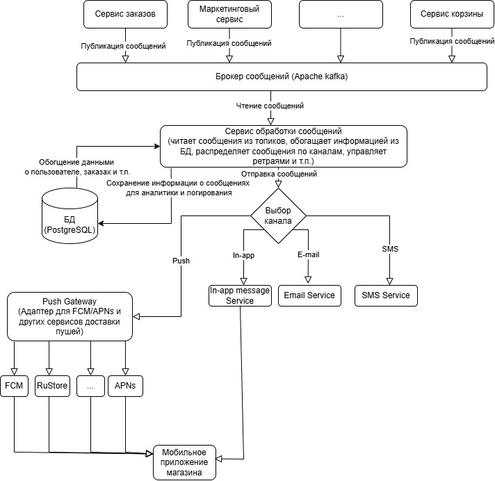

# Тестовое задание на вакансию Системного Аналитика в Effective Mobile

## Первое задание - анализ требований

### 1. Противоречия

|Пункты|Проблема|Описание|
|------|--------|--------|
|Пункт 1, Пункт 3 и Пункт 4|Противоречие в максимальном количестве товаров|В п.1 говорится, что можно добавить до 10 единиц одного товара. В п.3 говорится, что в корзине может быть не более 5 различных товаров. То есть совокупно пользователь может заказать до 50 единиц товаров. Но п.4 ограничивает максимальное количество всех товаров в корзине двадцатью. Непонятно, зачем нужно каждое из этих ограничений и в частности первые два, если последнее жестче|
|Пункт 2 и Пункт 9|Взаимоисключающие пункты| В п.2 говорится, что можно изменить количество товаров не менее чем до 1-го, а в п.9 говорится, что пользователь может уменьшить количество товара до 0. Неясно, какой из сценариев является приоритетным.|
|Пункт 7 и Пункт 13|Взаимоисключающие пункты| В п.7 говорится, что цена фиксируется на момент добавления в корзину, а в п.13 говорится, что если цена изменилась в каталоге, то система должна изменить ее в корзинах у всех пользователей. Неясно, какой из сценариев является приоритетным|

### 2. Недочеты

|Пункты|Проблема|Описание|
|------|--------|--------|
|Пункт 1, Пункт 3 и Пункт4|Неясный смысл ограничений|Все три пункта накладывают довольно жесткие ограничения на количество приобретаемых товаров, что может сильно повлиять на удобство пользователя и снизить количество покупок и средний чек|
|Пункт 5|Избыточность|В п.3 уже говорится, что в корзине может быть до 5 разных товаров и это в целом подразумевается из логики добавления товаров в корзину|
|Пункт 6|Недостаточная информативность|Сообщение "Лимит корзины превышен" не дает понимания, какой именно лимит превышен - ограничение в 10 единиц одного товара, ограничение на 5 товаров в корзине или ограничение на 20 единиц всех товаров в корзине. Стоит добавить проверку и отдельное сообщение для каждого варианта|
|Пункт 11|Неточность|Во-первых, "утром" и "вечером" довольно размытые понятия, стоит уточнить точные временные промежутки. Во-вторых, необходимо учитывать часовые пояса и определиться "утром" и "вечером" по времени сервера или по времени пользователя. В-третьих, несовсем понятно, что должно быть с рекламным блоком в остальное время - он должен скрываться или там должна показываться какая-то другая реклама.|
|Пункт 12|Ошибка нумерации| Пункт 12 пропущен - после пункта 11 идет сразу пункт 13. Непонятно - это просто опечатка или был пропущен какой-то существенный пункт|

### 3. Вариант исправленного ТЗ

Раздел ТЗ: Функционал корзины
1. Ограничения на добавление товаров в корзину
     1. Пользователь может добавить в корзину от 1 до 10 единиц одного товара
     2. Пользователь может добавить в корзину не более 5 разных товаров
     3. Суммарное количество всех товаров в корзине не может превышать 20 штук
2. Порядок проверок при добавлении/изменении количества товаров в корзине
    1. Сначала проверяется лимит на количество единиц одного товара
    2. Затем проверяется лимит на общее количество товаров в корзине
    3. Затем проверяется лимит на количество уникальных товаров в корзине
    4. При нарушении любого из лимитов система блокирует действие и выводит соотвествующее сообщение:
         - Максимальное количество этого товара не должно превышать 10 единиц
         - Максимальное общее количество товаров в корзине не должно превышать 20
         - Максимальное количество уникальных товаров не должно превышать 5
3. Управление составом корзины
   1. Пользователь может изменять количество единиц одного товара в диапазоне от 1 до 10
   2. При добавлении в корзину уже имеющегося там товара количество добавляемых единиц товара добавляется к единицам уже имеющегося товара
   3. Пользователь может удалить товар одним из двух способов:
      - Уменьшив счетчик единиц товара до 0, после чего товар удалится автоматически
      - Нажав на кнопку "Удалить" рядом с выбранным товаром
4. Отображение корзины
   1. В корзине отображается список товаров, количество, актуальная цена за единицу товара, общая стоимость позиции
   2. В корзине отображается итоговая сумма корзины
5. Ценообразование
   1. Цена товара в корзине является динамической и соотвествует текущей цене в каталоге на момент просмотра корзины или оформления товара
   2. Если цена товара в каталоге изменилась, то система должна автоматически изменить цену товара в корзине
   3. При изменении цены в корзине пользователю выводится уведомление "Цена на товар <Название товара> изменилась"
6. Реклама
   1. В сперциально отведенноой области в корзине может отображаться рекламный блок с другими продуктами
   2. Логика показа рекламного блока (время показа, таргетинг) должна настраиваться в админ-панели.
  

### 4. Уточняющие вопросы

1. Какой вариант поведения все-таки предпочтителен: фиксация цены на момент добавления товара в корзину или автоматическое обновление цены в корзине при изменении цены в каталоге?
2. Каким должен быть механизм удаления товара: только с помощью кнопки и запретом уменьшения количества единиц товара до 0 или возможность уменьшения количества единиц товара до 0? Возможно стоит оставить оба варианта - и по кнопке, и с помошью уменьшения количества единиц товара до нуля?
3. Откуда взялись ограничения на 5 различных видов товаров, на 10 единиц одного товара и на 20 товаров? Точно ли они нужны?
4. Что именно считать "различными товарами", которых может быть не более 5? Учитываются ли модификации (размер, цвет) как отдельные товары или как один товар с разными опциями?
5. Нужны ли разные сообщения для разных лимитов? В текущей версии ТЗ для всех лимитов одно сообщение. Так и должно остаться или лучше для каждого лимита свое?
6. При добавлении товара, который уже есть в корзине должно ли увеличиваться количество существующего товара или должна добавиться новая строка с таким же товаром? Если должна добавляться строка с таким же товаром, должен ли он учитываться в лимите на 5 различных товаров?
7. Что должно происходить, если товар был добавлен в корзину, но на складе он закончился до момента оформления заказа? Оформление блокируется, товар удаляется или предагается предзаказ?
8. Как считать "утро" и "вечер", какие это конкретно часы? Нужно ли отображать рекламу в эти часы по времени сервера или по локальному времени пользователя?
9. Какие товары должны рекламироваться (случайные, популярные, из той же категории)?
10. Должна ли реклама показываться только определенной группе пользователей или всем пользователям без исключения?
11. Есть ли ограничения по частоте показа для одного пользователя?
12. Требуется ли сохранение корзины после закрытия браузера для неавторизованных пользователей? Если да, то с помощью какого механизма?
13. Что происходит с корзиной после авторизации? Должны ли товары, добавленные в корзину до авторизации, добавиться в корзину авторизованного пользователя или должны полностью заменить ее или просто сброситься?
14. Должна ли быть у пользователя возможность ввести количество экземпляров товара с клавиатуры? Если да, то как система должна реагировать на ввод значения превышающего лимит?
15. То, что за 11 пунктом в исходном ТЗ идет 13-й это опечатка или какой-то существенный пункт был пропущен?

## Второе задание - проектирование API

### 1. Описание запроса

Описание эндпоинта в формате Open API можно посмотреть в файле [shopApi.yaml](shopApi.yaml)

Чтобы получить данные для отображения экрана из задания клиент должен отправить GET запрос на эндпоинт api/v1/partners без параметров. В качестве ответа эндпоинт должен вернуть массив объектов описывающих партнера. У каждого из этих объектов должны быть следующие поля:

|Наименование|Тип|Описание|Обязательный|Может быть NULL|
|------------|---|--------|------------|---------------|
|id|int64|Уникальный идентификатор партнера|Да|Нет|
|title|String|Наименование партнера|Да|Нет|
|link|String|Ссылка на сайт партнера|Да|Нет|
|logo|String|Ссылка на логотип партнера|Нет|Да|
|delivery|object|Объект хранящий информацию о доставке|Да|Нет|

Объект delivery может представлять из себя один из следующих типов данных:
- TimeslotDelivery - период времени в которое осуществляется ближайшая доставка
- DurationDelivery - минимальное и максимальное время за которое может быть осуществлена доставка в ближайшее время.

TimeslotDelivery содержит следующие поля:

|Наименование|Тип|Описание|Обязательный|Может быть NULL|
|------------|---|--------|------------|---------------|
|type|String|тип объекта с информацией о доставке (timeslot)|Да|Нет|
|startTime|time|Начало временного слота (например 18:00)|Да|Нет|
|endTime|time|Начало временного слота (например 18:00)|Да|Нет|

DurationDelivery содержит следующие поля:

|Наименование|Тип|Описание|Обязательный|Может быть NULL|
|------------|---|--------|------------|---------------|
|type|String|тип объекта с информацией о доставке (duration)|Да|Нет|
|minMinutes|integer|Минимальное время доставки в минутах|Да|Нет|
|maxMinutes|integer|Максимальное время доставки в минутах|Нет|Да|


### 2. Пример ответа

```json
[
  {
    "id": 1,
    "title": "METRO",
    "link": "https://metro.com",
    "logo": "https://link.to/image",
    "delivery": {
      "type": "timeslot",
      "startTime": "18:00",
      "endTime": "23:00"
    }
  },
  {
    "id": 2,
    "title": "ВкусВилл",
    "link": "https://vkusvill.ru",
    "logo": "https://link.to/vkusvill_image",
    "delivery": {
      "type": "duration",
      "minMinutes": 20,
      "maxMinutes": 60
    }
  }
]
```

## Третье задание - архитектура



На данной схеме в самом верху представлены микросервисы бэкенда, отвечающие за разные участки бизнес логики, которые могут создавать какие-либо уведомления. 

Все создаваемые ими уведомления отправляются в единый брокер сообщений (например, Apache Kafka) для хранения и передачи в сервис обработки сообщений. 

Этот сервис предназначен для распределения сообщений по каналам (push-уведомления, e-mail, SMS-сообщения, in-app уведомления), обогащения сообщений дополнительной информацией из БД, если это необходимо, сохранения информации об отправке сообщений в БД, организации повторной отправки при сбоях и прочих задач по управлению сообщениями. 

В зависимости от нужного канала сервис обработки сообщений передает сообщения в сервисы, управляющие каналами передачи. 

Сервис управляющий push-уведомлениями распределяет сообщения по сервисам доставки push-уведомлений в зависимости от операционной системы пользователя и доступности сервисов в соответствии с региональными ограничениями. При необходимости он может пытаться доставить push через альтернативные сервисы, если отправка через основной оказалась неуспешной по каким-то причинам.
